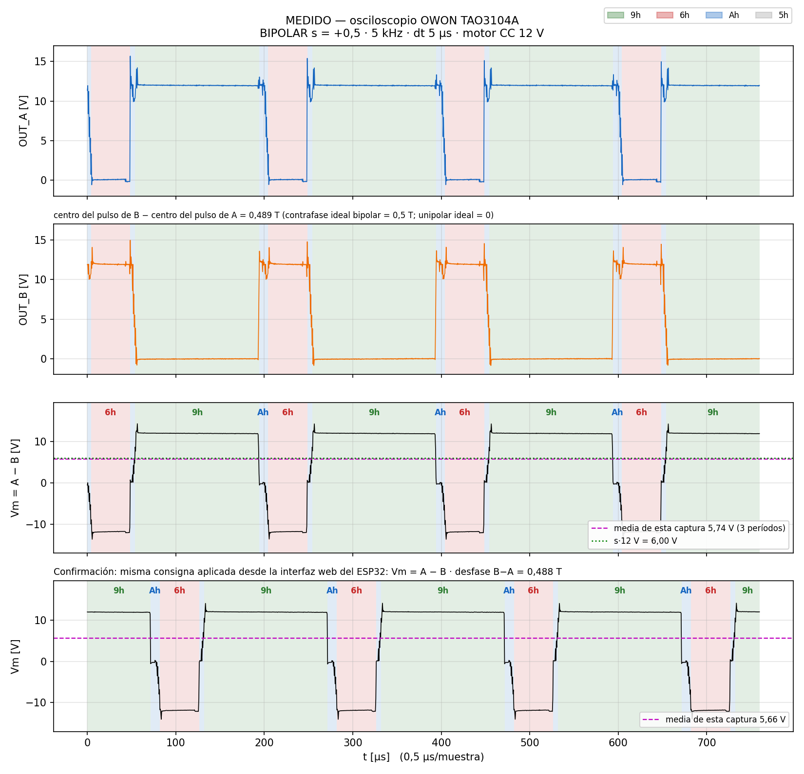
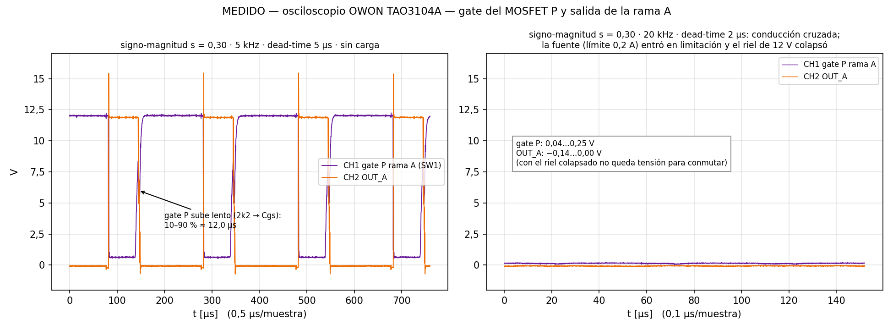

# puente-h-esp32s3

Firmware para manejar un **puente H completo (full bridge) de un motor de CC** con un
**ESP32-S3**, usando el periférico **MCPWM** con **dead-time por hardware**. Trae panel web
embebido (red WiFi propia), consola serie y herramientas de banco en Python.

*English summary: ESP32-S3 firmware for a discrete DC-motor full bridge (P-MOSFET high side,
N-MOSFET low side, inverting 2N2222 gate drivers). Hardware dead-time via MCPWM, three
modulation schemes (sign-magnitude, bipolar, unipolar), embedded web panel over its own
WPA2 access point, serial console, dead-man timeout. MIT licensed. Docs below are in Spanish.*

---

## ADVERTENCIA (leer antes de enchufar nada)

- **Esto conmuta potencia.** Un error de polaridad o de dead-time pone las dos llaves de una
  rama en conducción a la vez: **cortocircuito de la fuente a través de los MOSFET**. Usá una
  fuente con **límite de corriente** (en el banco: 0,2 A para las primeras pruebas) y nunca una
  batería sin fusible.
- **Antes de alimentar el puente**: analizador lógico en GPIO 4-7 y comando `p` (autochequeo
  de pines). `HA` y `LA` de la misma rama **nunca** pueden estar en `(1,0)`. Si lo ves, pará.
- Primera alimentación con **5-6 V y sin motor**. Recién después el motor.
- Los valores por defecto (**5 kHz, dead-time 5 µs**) son los que **se midieron andando** en
  esta placa. Con 20 kHz / 2 µs hay conducción cruzada (ver la medición de abajo): el gate del
  P-MOS tarda ~12 µs en apagarse con 2N2222 + 2k2. Para subir la frecuencia hace falta un driver
  de gate más rápido.
- **La red WiFi lleva una clave por defecto que es pública** (está en este README).
  Cambiala antes de usar la placa: cualquiera que se conecte puede mover el motor.
- Hombre muerto: si el panel web deja de dar señales de vida durante 4 s con el motor girando,
  el firmware lo corta solo. No reemplaza a una parada de emergencia física.
- Se entrega **sin garantía** (licencia MIT). Lo usás bajo tu responsabilidad.

## Hardware

| Bloque | Detalle |
|---|---|
| Placa | ESP32-S3-WROOM-1 N16R8 (cualquier S3 con GPIO 4-7 libres sirve) |
| Llaves | por rama: MOSFET **P** arriba (source a +12 V) y MOSFET **N** abajo |
| Drivers | un **2N2222 por gate, que INVIERTE** (pin en alto → gate a masa), pull-up de 2k2 a +12 V |
| Motor | entre OUT_A (rama A) y OUT_B (rama B), probado con un motor de CC de 12 V |

Por los 2N2222 inversores, las dos señales de una misma rama van al **mismo nivel** en régimen
(no complementarias). Por eso el firmware **no** usa `invert_output` como el ejemplo oficial de
ESP-IDF: con estos drivers esa bandera es un cortocircuito. Si cambiás a un driver que no
invierte (por ejemplo IR2104), el único lugar a tocar es `DRIVER_INVIERTE`.

### Pinout

| GPIO | Señal | Gate |
|---|---|---|
| 4 | `HA` | rama A, MOSFET P (arriba) |
| 5 | `LA` | rama A, MOSFET N (abajo) |
| 6 | `HB` | rama B, MOSFET P (arriba) |
| 7 | `LB` | rama B, MOSFET N (abajo) |

Consecutivos para enchufar el analizador de un tirón; se evitan los de arranque (0, 3, 45, 46),
el LED RGB (48) y el USB nativo (19, 20).

## Compilar y grabar

Arduino Core ESP32 3.x (`esp32:esp32:esp32s3`):

```
arduino-cli compile --fqbn esp32:esp32:esp32s3 MotorFullBridge_ESP32
arduino-cli upload  --fqbn esp32:esp32:esp32s3 -p COMx MotorFullBridge_ESP32
```

### Cambiar la clave de la red

La red se llama `PuenteH` y la clave por defecto es `cambiame-1234` (WPA2). Dos formas:

1. Editar `AP_CLAVE` al principio de `MotorFullBridge_ESP32/MotorFullBridge_ESP32.ino`.
2. Pasarla al compilar, sin tocar el archivo:
   ```
   arduino-cli compile --fqbn esp32:esp32:esp32s3 --build-property "compiler.cpp.extra_flags=-DAP_CLAVE=\"otraClave123\"" MotorFullBridge_ESP32
   ```

Tiene que tener entre 8 y 63 caracteres; si no, el firmware no levanta la red (lo avisa por
serie) y el puente queda manejable solo por USB. Con la clave por defecto, el arranque imprime
un aviso. `AP_SSID` se cambia igual.

Opcional: `USAR_WIFI_CASA 1` + un `wifi_casa.h` local (está en `.gitignore`, nunca se sube) con
`CASA_SSID` / `CASA_CLAVE` para colgarse además de una red existente.

## Uso

### Panel web
Conectate a la red `PuenteH` y abrí `http://192.168.4.1`. El panel va embebido en el firmware
(sin internet ni CDN).

API HTTP (la misma que usa el panel):

| Ruta | Qué hace |
|---|---|
| `GET /estado` | JSON de estado |
| `GET /cmd?v=<0-100>` | velocidad en % |
| `GET /cmd?m=<a\|r\|f\|s\|b\|u\|g>` | modo / modulación (mismas letras que la consola) |
| `GET /cmd?f=<Hz>` | frecuencia de conmutación |
| `GET /cmd?d=<ns>` | dead-time |

### Consola serie (115200, una línea + Enter)

| Comando | Acción |
|---|---|
| `v <0-100>` | velocidad en % |
| `a` / `r` | adelante / atrás |
| `f` | freno (los dos N prendidos, motor en corto) |
| `s` | libre / coast (las cuatro llaves cortadas) |
| `b` / `u` / `g` | modulación bipolar / unipolar / signo-magnitud |
| `h <Hz>` | frecuencia (1 000 a 50 000 Hz) |
| `d <ns>` | dead-time (paso de 25 ns, máx. 5 000) |
| `p` | autochequeo de pines (leer lo que el MCPWM está sacando) |
| `j` | estado en JSON (el mismo que `/estado`) |
| `?` | estado legible |

### Modulaciones

| Modo | Qué hace |
|---|---|
| Signo-magnitud (`g`) | una rama conmuta, la otra queda abajo |
| Bipolar (`b`) | rama B = complemento de la rama A; Vm medio = s·Vcc |
| Unipolar (`u`) | +v y −v contra la misma portadora triangular |

Por debajo del 4 % la salida queda en 0: el pulso sería más corto que el dead-time.

## Herramientas de banco (PC)

| Archivo | Qué es |
|---|---|
| `puente_serie.py` | puente HTTP ↔ puerto serie: el mismo panel anda con el USB enchufado (`python puente_serie.py COM16 8088`). Requiere `pyserial`. |
| `motor_ui.html` | panel de control para la PC (habla con el ESP por WiFi o vía `puente_serie.py`) |
| `banco_vivo.py` + `banco_vivo.html` | panel partido: ESP32 por serie + osciloscopio OWON TAO3104A por SCPI, con bitácora de todo lo enviado (`python banco_vivo.py COM4` → `http://127.0.0.1:8099/`) |
| `_alimentacion.html` | nota: cuántas fuentes hacen falta según la tensión del motor |
| `MotorFullBridge/MotorFullBridge.ino` | versión anterior para STM32F103 "Blue Pill" (TIM1 complementario, control por RTT) |

## Mediciones (osciloscopio OWON TAO3104A, motor de CC de 12 V)

Bipolar, s = +0,5, 5 kHz, dead-time 5 µs: Vm medio 5,74 V contra 6,00 V ideal.



Por qué el default es 5 kHz / 5 µs: a la izquierda, gate del P-MOS subiendo en ~12 µs; a la
derecha, 20 kHz con 2 µs de dead-time → conducción cruzada, la fuente entra en limitación y el
riel de 12 V colapsa.



## Licencia

MIT, ver [LICENSE](LICENSE). Hecho por Matías Alegre, Pandemonium (PNDM).
